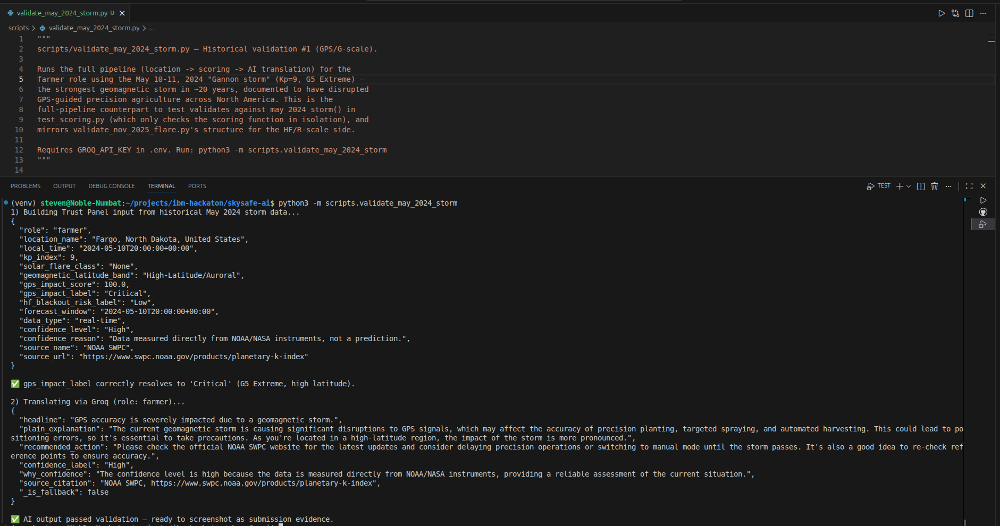
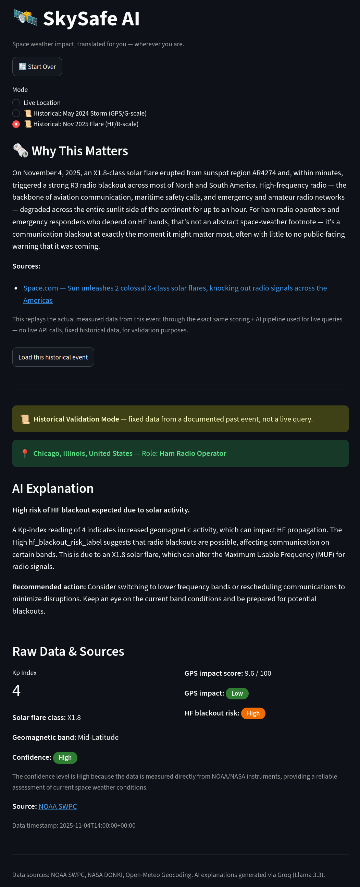
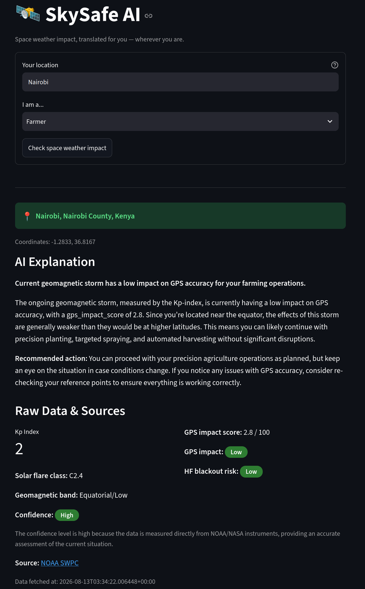
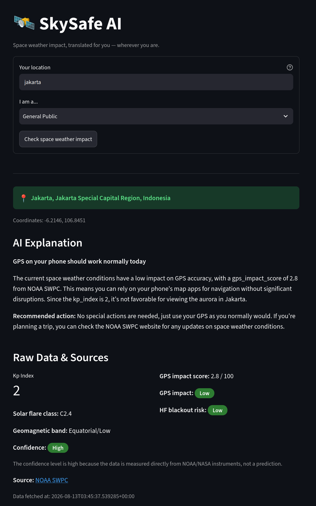
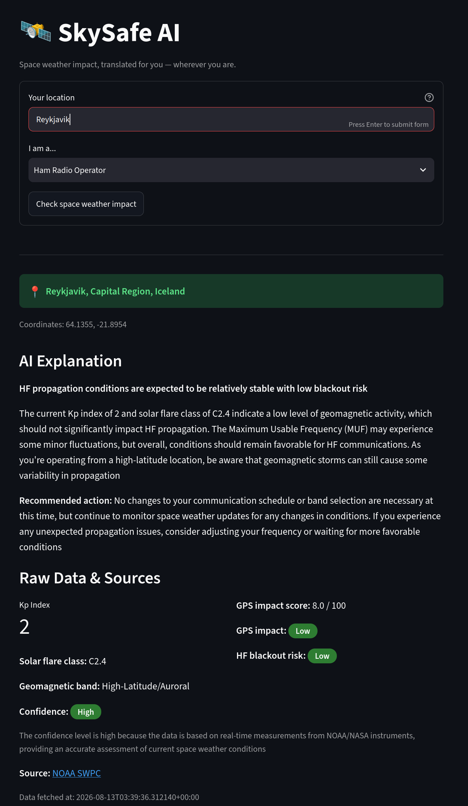
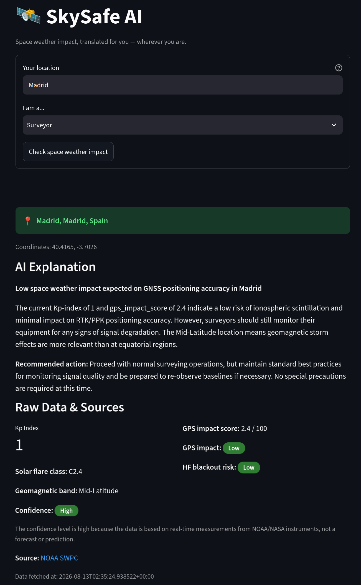

# 🛰️ SkySafe AI

**Space weather impact, translated for you — wherever you are.**

Challenge theme: **Advance Space Exploration with AI**

Submitted by: **Steven Oktavian Tampubolon** (solo)

🚀 **Try it live:** https://skysafe-ai.streamlit.app/

🎥 **Demo video:** _[YouTube link — TODO, add after recording]_

---

## Motivation

Public space weather data exists — NOAA and NASA publish Kp-index
readings, solar flare classifications, and storm forecasts in real time,
for free. But that data is written for space weather scientists, not for
the people whose daily work actually depends on GPS and HF radio: farmers
running RTK-guided tractors, land surveyors doing GNSS positioning, and
ham radio operators relying on HF propagation. SkySafe AI closes that gap
— turning raw space weather data into role-specific, actionable guidance
anyone in the world can understand, backed by a Trust Panel that never
hides the raw numbers behind the AI's words.

## Demo

<table>
  <tr>
    <td></td>
    <td></td>
  </tr>
</table>

## How to Use

1. **Enter a location** — any city, region, or country name, anywhere in the world.
2. **Pick a role** — Farmer, Surveyor, Ham Radio Operator, or General Public.
3. **Get your briefing** — the AI Explanation section gives you plain-language impact and a recommended action.
4. **Check the Trust Panel** — the Raw Data & Sources section shows every number and source the explanation is based on, so nothing is taken on faith.
5. **Or try Historical Validation mode** — replay two real, documented space weather events through the exact same pipeline used for live queries.
6. **Add a daily reminder** — after checking your Trust Panel, download a
   recurring `.ics` calendar reminder that links straight back to your
   personalized brief tomorrow — no login, no backend, just your calendar
   app doing what it already does well.

---

## Problem Statement

Public space weather data exists — NOAA and NASA publish Kp-index
readings, solar flare classifications, and storm forecasts in real time,
for free. But that data is written for space weather scientists, not for
the people whose daily work actually depends on GPS and HF radio: farmers
running RTK-guided tractors, land surveyors doing GNSS positioning, and
ham radio operators relying on HF propagation.

The gap isn't access — it's translation. A raw "Kp=8, X2.0 flare" reading
means nothing actionable to a farmer deciding whether to run the planter
today. This isn't hypothetical: the May 10-11, 2024 "Gannon storm" (the
strongest geomagnetic storm in ~20 years) disrupted GPS-guided precision
agriculture across the US Midwest, costing farmers an estimated
**$500-565 million** in delayed planting and lost yield, according to a
Kansas State University study. On November 4, 2025, an X1.8 solar flare
triggered a strong R3 radio blackout across most of North and South
America — a direct hit on HF communications, including amateur and
emergency radio networks. Most of the people affected by these events had
never even heard the term "space weather" before their equipment stopped
working.

This problem is also global, not just North American: the same storm has
a very different practical impact on a farmer in Fargo versus a farmer in
Nairobi, because geomagnetic storm effects concentrate near the poles —
yet no existing consumer-facing tool accounts for that.

## Solution Description

SkySafe AI is a 4-layer system that turns public space weather data into
role-specific, actionable guidance for anyone, anywhere in the world:

1. **Ingestion** — fetches real-time and forecast data from NOAA SWPC
   (Kp-index) and NASA DONKI (solar flares), with error handling and local
   cache fallback.
2. **Deterministic scoring** — pure, auditable functions that map raw data
   to impact scores using NOAA's official G-scale (geomagnetic) and R-scale
   (radio blackout) tables, adjusted for the user's **geomagnetic latitude**
   (not geographic — Earth's magnetic pole is offset from the geographic
   pole) so the same storm is scored differently for a farmer near the
   equator versus one near the pole.
3. **AI translation layer** — Groq (Llama 3.3) translates the deterministic
   score into natural-language, role-specific guidance for one of 4 roles:
   Farmer, Surveyor, Ham Radio Operator, or General Public.
4. **Trust Panel** — a Streamlit UI showing the AI's explanation **and**
   the raw score, confidence level, and source citation side by side, so
   nothing the AI says has to be taken on faith.

The system also includes global location search (geocoding via
Open-Meteo) and a **Historical Validation mode** that replays two real,
documented events (May 2024 storm, November 2025 flare) through the exact
same pipeline as live queries — proof that the scoring holds up against
real-world outcomes, not just synthetic test cases.

## AI Approach and System Architecture
Location name → Geocoding → lat/lon → Geomagnetic latitude band
│
NOAA SWPC / NASA DONKI → Ingestion → Scoring (latitude-adjusted) → AI Translation → Trust Panel
(raw data) (fetch+cache) (deterministic) (Groq LLM) (per-role, English)

**The core design principle: the AI never computes or invents numbers.**
Every score (GPS impact, HF blackout risk, confidence level) comes from a
pure-function scoring module, fully unit-tested, traceable to official
NOAA tables. The AI's only job is translation — and even then, its output
is validated against the original input before being shown to the user.
If the AI changes any key value, the output is rejected and a static
fallback is used instead. This is enforced by the system prompt given to
the AI on every single call:

You are the translation layer for SkySafe AI. Your ONLY job is to translate
space weather impact data and scores that have ALREADY been calculated
deterministically into language that is easy to understand for the given
user role. Always respond in English, regardless of the user's location.

YOU MUST NOT:

Recalculate, correct, or change any number/score/index given in the input.
All numbers are final facts.
Invent any new prediction, number, or claim not present in the input data.
Give absolute guarantees ("definitely safe", "definitely fine", "guaranteed
normal").
...

*(Full system prompt: `ai_layer/translator.py`.)*

This separation — deterministic scoring, AI translation, code-level
validation — is what makes the Trust Panel trustworthy rather than just
another chatbot wrapper around space weather data.

## Challenge Theme

**Advance Space Exploration with AI.**

SkySafe AI advances this theme not by exploring space itself, but by
making a form of space science that already directly affects millions of
people — space weather — genuinely usable by them. It takes data that is
technically public but practically inaccessible to non-specialists, and
turns it into decisions people can act on the same day: whether to run a
GPS-guided planter, whether to trust an RTK fix, whether to switch HF
bands. AI is the layer that makes this translation possible at the scale
and speed a human expert-on-call couldn't match, while the deterministic
scoring underneath keeps that AI honest and auditable.

## How IBM Bob Was Used in This Project

Every module in this project — `ingestion.py`, `scoring.py`,
`translator.py`, and the Streamlit UI — was built through IBM Bob's Agent
mode, using detailed, iterative prompts per sprint task. Two representative
examples actually used during development:

**Week 1, data ingestion (`ingestion/ingestion.py`):**
> "Buatkan module `ingestion.py` dengan fungsi `fetch_kp_index()` yang
> mengambil data dari [url NOAA] dan `fetch_flare_data()` dari [url DONKI],
> gabungkan ke `get_current_conditions()` yang mengembalikan schema JSON
> berikut: [tempel schema]. Tambahkan error handling untuk timeout/API
> down, dan buat unit test di tests/test_ingestion.py dengan mock response."

**Week 2, geomagnetic latitude adjustment (`scoring/scoring.py`)** — the
task considered highest-risk in the sprint plan, since it required a new
scientific formula rather than a straightforward API integration:
> "Add a function get_geomagnetic_band(lat, lon) in scoring.py using this
> dipole approximation formula: [tempel formula], geomagnetic north pole
> at 80.7N, 72.7W. Classify into 'Equatorial/Low' (<30°), 'Mid-Latitude'
> (30-55°), 'High-Latitude/Auroral' (>55°). Update score_gps_impact() to
> accept lat/lon and apply a multiplier: High=1.0, Mid=0.6,
> Equatorial=0.35. Add unit tests for Fairbanks Alaska, London UK, and
> Nairobi Kenya."

Each Bob-generated module was reviewed, tested against edge cases, and
iterated on — including fixing real bugs Bob's initial output missed
(e.g. NOAA's actual JSON response format differing from the assumed
schema, G-scale tier boundary rounding errors), which are documented in
the git commit history.

---

## Global Location Testing (Week 2)

Same storm, same Kp-index, four different locations — the Trust Panel
correctly reflects that geomagnetic impact isn't uniform across the globe.

<table>
  <tr>
    <td></td>
    <td></td>
  </tr>
  <tr>
    <td></td>
    <td></td>
  </tr>
</table>

## Historical Validation

SkySafe AI's scoring is validated against two real, documented space
weather events — not just synthetic test cases:

| Event | Metric validated | Result |
|---|---|---|
| May 10-11, 2024 "Gannon storm" (Kp=9, G5 Extreme) | GPS impact / G-scale | Correctly resolves to "Critical" at high latitude, "Moderate" near the equator |
| Nov 4, 2025 X1.8 flare (AR4274) | HF blackout risk / R-scale | Correctly resolves to "High" (R3 Strong), matching NOAA's real classification |

Both can be replayed live via the app's **"Historical Validation"** mode,
which runs the exact same pipeline used for live queries against fixed,
documented historical data.

## Known Limitations

- **HF blackout risk does not currently check day/night at the user's
  location.** Physically, HF radio blackouts from solar flares only
  affect the sunlit side of Earth at the moment of the flare — unlike
  geomagnetic storm impact, which depends on latitude rather than time of
  day. SkySafe AI's `hf_blackout_risk_label` reflects the flare's R-scale
  severity correctly, but does not yet reduce that risk for users on the
  night side of Earth during the event. This is a deliberate scope
  decision for the hackathon timeline, not an oversight — documented here
  rather than hidden, consistent with the project's trust-first design.
- **Geomagnetic latitude is a dipole approximation**, not a
  high-precision model (IGRF). It is sufficient to demonstrate that
  impact genuinely varies by location, but is a deliberate simplification
  for hackathon scope, not a claim of full scientific precision.

## Daily Reminder

SkySafe AI can generate a personalized, recurring daily calendar reminder
(`.ics`, RFC 5545) with zero backend infrastructure — no scheduler, no
push service, no account system. It rides entirely on the calendar app
the user already trusts. The reminder text is intentionally static
("check your conditions today") rather than the actual live score, since
a live score would require a server-side feed independent of the user's
browser — the reminder's deep link, which pre-fills the user's location
and role, is what keeps it useful without that infrastructure.

## Tech Stack

Python 3.12, Streamlit, `requests`, `pytest`, Groq API (`llama-3.3-70b-versatile`),
Open-Meteo Geocoding API.

## Data Sources

- [NOAA SWPC Planetary K-index](https://services.swpc.noaa.gov/products/noaa-planetary-k-index.json)
- [NOAA SWPC 3-Day Forecast](https://services.swpc.noaa.gov/text/3-day-forecast.txt)
- [NASA DONKI Solar Flare API](https://api.nasa.gov/DONKI/FLR)
- [Open-Meteo Geocoding API](https://open-meteo.com/en/docs/geocoding-api)
- [NOAA Space Weather Scales](https://www.swpc.noaa.gov/noaa-scales-explanation)

## Setup

```bash
python3 -m venv venv
source venv/bin/activate
pip install -r requirements.txt
cp .env.example .env
# fill in GROQ_API_KEY and NASA_DONKI_API_KEY in .env
```

## Running Tests

```bash
python3 -m pytest -v
```

## Running the App

```bash
streamlit run ui/app.py
```